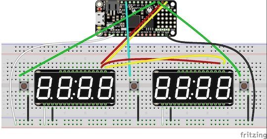
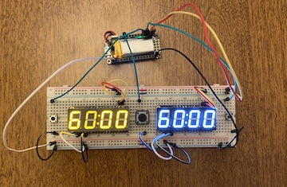

# Chess Clock

chess-clock is a CircuitPython library for creating and controlling a chess clock.

This library handles both the software and hardware implementation.

Created with CircuitPython v5.3.0 on an Adafruit Feather M0 Express - Designed for CircuitPython - ATSAMD21 Cortex M0

## Installation

Clone the repository.

If your hardware needs the memory optimized it is recommended to convert ```timer.py``` and ```chessclock.py``` to *.mpy* files. [Seen here.](https://learn.adafruit.com/adafruit-feather-m0-express-designed-for-circuit-python-circuitpython/frequently-asked-questions#how-can-i-create-my-own-mpy-files-3-11)

Copy ```code.py```,```timer.(m)py``` and ```chessclock.(m)py``` to your circuitpython device.

## Hardware Overview

1 x [Featherboard M0 w/ circuitpython](https://www.adafruit.com/product/3403)

2 x [7-segment display](https://www.adafruit.com/product/3109) Be sure to set up unique addresses ([guide](https://learn.adafruit.com/adafruit-led-backpack/changing-i2c-address#changing-addresses-50-1))

3 x Buttons (Left side, right side, power/reset)

1 x [Lithium Ion Polymer Battery](https://www.adafruit.com/product/2750) (recommended)

#### Fritzing Example



#### Real Example



## Usage

Configure your clock as desired in `code.py`.

```python

player_1 = chessclock.ChessClock(time_left = 60,
                                 display = segments.Seg7x4(i2c),
                                 pin = DigitalInOut(board.D6),
                                 increment = 5)

player_2 = chessclock.ChessClock(time_left = 60,
                                 display = segments.Seg7x4(i2c, address=0x71),
                                 pin = DigitalInOut(board.D5),
                                 increment = 5)

```

Clock will start after a button is pressed. When the active player presses their button, their timer will pause (and an increment will be added if applicable) and the other player's timer will start.

Timers will continue counting down until one hits 00:00, indicating game over by time out.

## Contributing
Pull requests are always welcome. For major changes, please open an issue first to discuss what you would like to change.

Fork > Clone Fork > Branch Clone > Make Changes > Commit Branch > Pull Request
